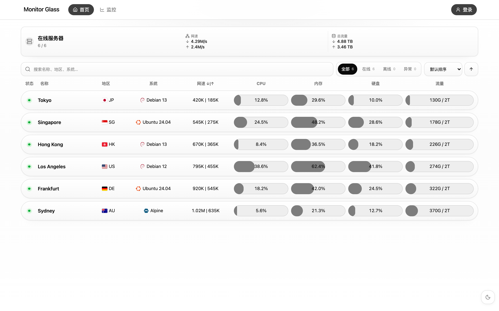

# Monitor Glass

它采用 Once UI 风格的中性视觉体系，并针对服务器监控场景重新设计了首页、节点详情、历史图表和移动端交互。



## 特点

- Once UI 风格的 Gray / Black 中性界面
- 首页汇总与服务器卡片统一视觉层级，搜索、状态筛选和指标排序可组合使用
- ServerStatus 风格的紧凑指标列、抽屉详情与完整监控页
- iOS / 移动端优先的布局与滚动优化
- 在线状态 Pulse、按需加载的资源历史图表与三网延迟展示
- 独立 Release：安装包只从本仓库发布

## 安装

从 [Releases](https://github.com/wxte/Monitor-Glass/releases) 下载 `theme.tar.gz`，在 Monitor hub 后台「主题」页上传。

也可以解压到 hub 的 `--themes` 目录下，例如：

```text
themes/
└── glass/
    ├── dist/
    └── theme.json
```

## 版本

当前正式版本为 **v1.1.0**。此版本面向 Monitor Hub 1.3，包含首页与监控页、节点详情和历史资源/三网延迟图表，并统一服务器指标进度条与筛选、时间范围标签的视觉状态。图表代码按需加载，首页只请求节点与站点状态数据。

## 预览图与验证

`preview.png` 是当前主题页面在 1440 × 900 视口下的真实截图，使用合成监控数据，不包含任何真实服务器信息。更新界面后，可先运行 `npm run dev:demo`，再在另一个终端运行 `npm run preview:image` 重新生成。

提交前依次运行 `npm run lint`、`npm test`、`npm run test:browser`、`npm run build` 和 `npm run check:release`。浏览器测试使用构建后的静态页面，覆盖桌面和手机布局（含高像素比手机文本缩放）、搜索筛选、排序、抽屉键盘操作及图表导航。发布工作流会在检查通过后生成安装归档及 SHA-256 校验文件。

## 许可与第三方

Monitor Glass 以 MIT License 发布。

第三方设计 token / 开源资源的许可说明见 [THIRD_PARTY_NOTICES.md](THIRD_PARTY_NOTICES.md)。历史代码中需要保留的版权声明继续保留在 [LICENSE](LICENSE) 中；这些声明仅用于许可合规，不代表本主题存在上游发布或更新依赖。
